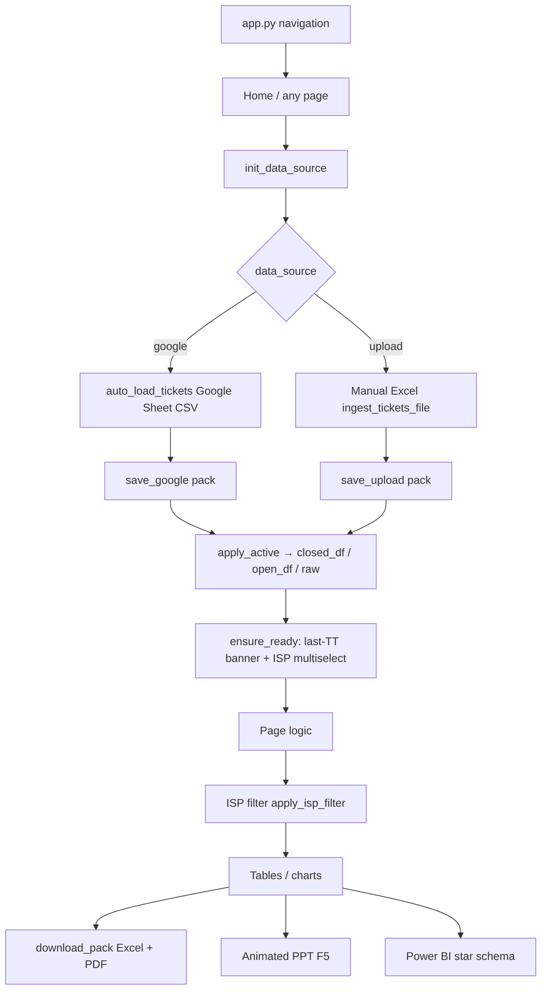

# Xtranet NOC — Full Workflow & Page Catalogue

**Product:** Xtranet NOC Command Center (repo: `rchaurasiya1075/XTRNATE-Project`)  
**Stack:** Streamlit multipage + pandas + Plotly + Google Sheets + Firebase + forest-green Excel/PDF + python-pptx  
**Entry:** `app.py` → `st.navigation` → `pg.run()`  
**Live data:** Google Sheet `1ELusYn2el4_rvHJYFD1_c92FN4SVQ1Cgwp-BwFADi8I` (tickets tab gid `1980854633`) **or** a manual Excel the operator loads.

This document is the operator + developer map: **what the app does, how data moves, and what every page/file is for.** Full source lives in the files named below — this is the workflow, not a dump of 8,000 lines.

---

## 1. What this app is

Xtranet NOC builds **ticket / SLA / last-mile / SIM reports** for Hughes-style NOC work across client projects:

| Project slot | Typical use |
|---|---|
| Xtranet | Default live Google Sheet (KD / Hughes) |
| Shell | Manual Excel pack for Shell |
| Backhaul | Manual Excel pack |
| Link | Manual Excel pack |
| DGLL | Manual Excel pack |
| *(Add project)* | Any extra client name |

Every analysis page reads the **same three live frames**:

| Session key | Meaning |
|---|---|
| `closed_df` | Resolved / closed tickets (after status split) |
| `open_df` | Open tickets (`Assign to FE` / `Call on Hold` / `on hold`) |
| `raw_tickets_df` | Combined processed tickets |

Those three pointers **always follow** `active_project` + `data_source` (`google` | `upload`). Reports never mix sources unless the operator switches the radio.

---

## 2. End-to-end workflow



### Daily operator path

1. Open the app → Home auto-loads Google Sheet (5-minute cache) **unless** Upload mode is on.
2. Set **Client / project** (Xtranet / Shell / …).
3. Set **Use this for all reports**: Google Sheet **or** Manual Excel.
4. Tick **ISP / Partner** (Owner names). Empty selection = warning; **All ISPs** fills the list.
5. Open the page you need (Site Search, Partner Report, SLA, …).
6. Download forest-green Excel / PDF, or animated PPT, or Power BI model.

### Upload path (does not steal Google)

1. **Uploaded Excel** mode **or** Tools → Upload Data.
2. Choose `.xlsx` / `.csv` → **Load file** / **Use this Excel for all reports**.
3. File is stored in `project_store[project]["upload"]`.
4. `closed_df` now points at that pack.
5. **Force Refresh Google Sheet** updates only the Google slot. If mode is Upload, reports stay on the Excel.

### Open vs closed split (every ingest)

Status text, case-insensitive:

- Open if contains `assign to fe` **or** `call on hold` **or** `on hold`
- Else Closed

Then `process_closed_tickets` / `process_open_tickets` normalise columns (`site_code`, `ticket_id`, `submitted_time`, `resolved_time`, `down_time_min`, `owner`/`isp`, `reason`/`category`, `resolution_hours`, …).

---

## 3. Navigation map (`app.py`)

Sidebar groups — this **is** the product map.

### Home
| Page | File |
|---|---|
| Home | `home_page.py` |

### Tickets
| Page | File |
|---|---|
| Site Search | `pages/0_Site_Search.py` |
| Dashboard | `pages/1_Dashboard.py` |
| Multi Site Tracker | `pages/23_Multi_Site_Tracker.py` |
| Open Escalation | `pages/4_Open_Escalation.py` |
| Open Calls | `pages/7_Open_Calls_Dashboard.py` |
| Closed Analysis | `pages/3_Closed_Analysis.py` |
| Repeat Analysis | `pages/6_Repeat_Analysis.py` |

### ISP & Partner
| Page | File |
|---|---|
| ISP Comparison | `pages/8_ISP_Comparison.py` |
| Partner Report | `pages/12_Partner_Report.py` |
| Vendor Performance | `pages/9_Vendor_Performance.py` |
| Vendor Change | `pages/20_Vendor_Change.py` |

### SLA & Reports
| Page | File |
|---|---|
| Monthly SLA | `pages/11_Monthly_SLA_Report.py` |
| Penalty SLA | `pages/10_Penalty_SLA.py` |
| Holiday Downtime | `pages/17_Holiday_Downtime.py` |
| Conclusion PPT | `pages/16_Conclusion.py` |

### Daily Ops
| Page | File |
|---|---|
| VPN Update | `pages/14_VPN_Update.py` |
| Pending Mail | `pages/15_Pending_Mail.py` |

### SIM & Last Mile
| Page | File |
|---|---|
| SIM Inventory | `pages/19_SIM_Inventory.py` |
| SIM Data Usage | `pages/18_SIM_Backup_Usage.py` |
| Circuit ID | `pages/13_Circuit_ID.py` |
| LC Master | `pages/21_LC_Master.py` |
| Last Mile Update | `pages/22_Last_Mile_Update.py` |

### Tools
| Page | File |
|---|---|
| Power BI | `pages/25_Power_BI.py` |
| Excel to PPT | `pages/24_Excel_to_PPT.py` |
| Upload Data | `pages/2_Upload_Data.py` |
| Escalation Matrix | `pages/5_Escalation_Matrix.py` |

---

## 4. Shared session contract

Set in `app.py` + `utils/data_source.py` + `utils/bootstrap.py`.

| Key | Role |
|---|---|
| `projects` | List: Xtranet, Shell, Backhaul, Link, DGLL + user adds |
| `active_project` | Current client pack |
| `data_source` | `"google"` or `"upload"` |
| `project_store[name][google\|upload]` | `{closed, open, raw, note, n_closed, n_open}` copies |
| `closed_df` / `open_df` / `raw_tickets_df` | Live pointers after `apply_active()` |
| `selected_isps` | Multi-select Owner/ISP names |
| `selected_isp` | Label string (`ALL` / `NONE` / comma list) |
| `site_master` | Optional bank/branch/state merge |
| `data_last_updated` | IST timestamp for last Google fetch |
| `pbi_embeds` | Per-project Power BI view URLs |

**ISP filter:** `apply_isp_filter(df)` keeps rows whose `owner`/`isp` is in `selected_isps`. Most report pages call this. Site Search uses the full active source (all ISPs in that file) so a code lookup is not hidden.

**Last-update banner:** `show_last_update()` — max `submitted_time` across raw/closed/open = last TT raise, shown IST + “N hr ago”, plus `source_status()`.

---

## 5. Page-by-page (what it does)

### 5.1 Home — `home_page.py`

**Job:** Landing + data-source control + quick search + multi-site + page directory.

**Does:**
- `init_data_source()` then auto-load Google **only if** `closed_df` is empty and mode is not Upload.
- `render_source_bar()` — project select, Google vs Manual Excel radio, ticket counts.
- Site code quick search → `render_site_history_panel`.
- Multi Site Tracker embed (`render_multi_site_pack`).
- ISP multiselect + **Force Refresh Google Sheet** (`cache_data.clear` + `auto_load_tickets(force=True)`). Refresh **does not** overwrite Upload mode.
- Live Status metrics (closed/open for selected ISP).
- Category tiles that `st.switch_page` into every route.

---

### 5.2 Site Search — `pages/0_Site_Search.py` + `utils/site_search.py`

**Job:** Look up one site in **only the selected source**. Fast.

**Does:**
- Data mode radio: Google Sheet | Uploaded Excel. Upload mode **never** calls Google.
- Inline file uploader + **Load file** → `ingest_tickets_file`.
- Search box → `render_site_history_panel`: past downs, open now, downtime hrs, reason breakdown, Excel download (PDF skipped here so search stays fast).
- Expander: last 30 days buckets **3 / 5 / 6 / 7+** (plus 1/2/4).
- Expander: frequent site codes in this source.

**Key functions:** `_upper_col` (cached uppercase site index), `get_site_history`, `last_month_down_counts`.

---

### 5.3 Dashboard — `pages/1_Dashboard.py`

**Job:** Command view of the active source.

**Does:**
- Forest-green scorecards (not the old blue theme).
- Multi-site pack.
- Period: Last 1M / 3M / 6M / All.
- KPIs: closed count, DT hrs, avg resolve, currently open, critical ≥8h.
- Charts: downtime by state, tickets by owner, top reasons (`plotly_white` + green scale).
- Open calls table + escalation levels + `download_pack`.

---

### 5.4 Multi Site Tracker — `pages/23_Multi_Site_Tracker.py` + `utils/site_pack.py`

**Job:** Paste many site codes (comma / space / newline), max 80.

**Does:** For each code: ticket history, open tickets, SIM, circuit ID, LC, last mile, bank/branch. One summary row per site. Excel+PDF pack (`Summary`, `Ticket_History`, `Open_Tickets`, `SIM`, `Circuit`, `LC`, `Last_Mile`).

**Helpers:** `parse_site_codes`, `build_pack`, extra Google tabs for SIM/circuit/LC loaded via `_safe_load`.

---

### 5.5 Open Escalation — `pages/4_Open_Escalation.py`

**Job:** Live open tickets with colour-coded L1–L4 from the per-ISP matrix.

**Does:**
- `apply_escalation_to_open` using `load_escalation_matrix(isp)`.
- Filters, metrics, table sorted by `open_hours`.
- Auto history for every open site: downs in 1M/3M/4M/6M.
- Pick a site → closed history (days to resolve, last enclosure).

---

### 5.6 Open Calls — `pages/7_Open_Calls_Dashboard.py`

**Job:** Open-call list (Assign to FE / On Hold) + **one** selected site’s history (not overall).

**Does:** State/status charts, table, site history panel for the selected code only.

---

### 5.7 Closed Analysis — `pages/3_Closed_Analysis.py`

**Job:** Deep closed-ticket analytics for the period + ISP.

**Does:** Filters, downtime by state, tickets over time, worst sites by DT, reason mix, detailed table + downloads.

---

### 5.8 Repeat Analysis — `pages/6_Repeat_Analysis.py`

**Job:** Chronic sites and areas.

**Does:**
- State → City → full ticket list (site, incident, submitted, resolved, reason).
- Most repeated site codes; drill into each occurrence.
- Category mix + resolution ageing.
- Live open tickets for the same ISP filter.
- Summary download.

---

### 5.9 ISP Comparison — `pages/8_ISP_Comparison.py`

**Job:** One-ISP review for a date range (Owner’s names).

**Does:**
- Outage classification from last remark (`detect_category` / remark tags).
- Daily ticket counts, state mix, site list.
- Repeat: those sites’ 3M and 6M history + reason + downtime per ticket.
- Ticket-wise table, current open.
- Excel + **animated PPT** (`build_animated_pptx`, F5).

---

### 5.10 Partner Report — `pages/12_Partner_Report.py`

**Job:** Full partner pack for a period. Four numbered blocks with **ticket drill-down per option**.

**Blocks:**
1. **Resolution Time Buckets (SLA)** — `<2h`, `2-4h`, `4-8h`, `8-12h`, `12-24h`, `24-48h`, `48-72h`, `>72h`. Expand = tickets.
2. **Problem Classification** + mapped Others / Force Majeure / Housekeeping (ONU reboot, vendor change, payment, natural calamity, speedtest, firewall…). Expand = tickets.
3. **Problem Related To** — Third Party, Housekeeping, Force Majeure, Vendor Change, Cannot Duplicate. Expand = tickets.
4. **Repeat Call Analysis** — 1 / 2 / 3 / 4 / 5+ times; expand = **which sites + which tickets**.

Also: Vendor Change tickets this period; Excel/PDF pack; animated PPT.

Reload DATA tab writes **Google slot only** — Upload reports stay on Excel.

---

### 5.11 Vendor Performance — `pages/9_Vendor_Performance.py`

**Job:** Partner scorecard from `owner`.

**Does:** Volume, DT, repeats (2+), category mix, current open, vendor detail expander.

---

### 5.12 Vendor Change — `pages/20_Vendor_Change.py`

**Job:** Register of vendor-change remarks → Firebase.

**Does:** Detect remarks (`alternate service provider`, `migration`, `not feasible`, …). Sync sheet → Firestore `vendor_changes`. Operators set `work_status` / `new_isp` / `lc_note`. Merge does **not** overwrite operator fields.

Needs Firebase secrets. If missing, page stops with setup text.

---

### 5.13 Monthly SLA — `pages/11_Monthly_SLA_Report.py`

**Job:** Daily resolve counts in time buckets, all Owner ISPs, weekend/holiday logic.

**Does:** Month picker, ISP `<24h` vs `>24h`, daily tables, downloads.

---

### 5.14 Penalty SLA — `pages/10_Penalty_SLA.py`

**Job:** Estimated penalty from long downtime.

**Does:** Per-ISP summary; per-site times-down, avg/max hours, total DT, estimated penalty; ticket lists.

---

### 5.15 Holiday Downtime — `pages/17_Holiday_Downtime.py` + `utils/holiday_sla.py`

**Job:** Subtract Sunday, 2nd Saturday, 4th Saturday, public/festival holidays from Submitted→Resolved.

**Does:** Reported DT vs holiday-minus vs adjusted DT (working-hour SLA clock). Built-in holiday calendar expander.

---

### 5.16 Conclusion PPT — `pages/16_Conclusion.py` + `utils/meeting_deck.py` + `utils/anim_deck.py`

**Job:** Meeting pack.

**Does:** Outage reasons (click → sites), remark micro-tags, repeat 3M/6M, resolution bands, 15-slide PPT + **animated** graph PPT (GIF line-draw / bar-grow + right-side explanation).

---

### 5.17 VPN Update — `pages/14_VPN_Update.py`

**Job:** Daily VPN / HO / backup status sheet in the screenshot layout.

**Does:** Filter by submitted time, HO vs branch backup, PNG snapshot download.

---

### 5.18 Pending Mail — `pages/15_Pending_Mail.py`

**Job:** Mail-ready open-call list from the OPEN CALLS sheet.

**Does:** One tab per selected ISP; preview + copy. Other ticket pages unchanged.

---

### 5.19 SIM Inventory — `pages/19_SIM_Inventory.py`

**Job:** Site / MDN / IP search on the SIM inventory tab.

**Does:** Status, telco, plan limit table + download.

---

### 5.20 SIM Data Usage — `pages/18_SIM_Backup_Usage.py`

**Job:** Backup SIM GB vs broadband downs (10 GB plan).

**Does:** Month GB columns (`Aug Usage in GB` pattern). High usage ≈ unstable BB. Filters; ISP split; month-wise; site list (Branch + State + ISP). Extra sheet gid `710549453`.

---

### 5.21 Circuit ID — `pages/13_Circuit_ID.py`

**Job:** Site code → circuit ID lookup.

**Does:** Search, copy box, table copy.

---

### 5.22 LC Master — `pages/21_LC_Master.py`

**Job:** LC name / number / mail / bank for a site. Same number is not stored twice.

**Does:** Search, pending-mail vs LC, manual update, full LC tab (`gid 401145054`), batch write via `sheet_write`.

---

### 5.23 Last Mile Update — `pages/22_Last_Mile_Update.py`

**Job:** Show old last mile + LC; save a **new** row to Firebase **and** Google Sheet `LastMile_Updates`.

**Does:** Site lookup, form (new ISP / LC name / number), history list. Needs Editor share on the sheet for the service account.

---

### 5.24 Power BI — `pages/25_Power_BI.py` + `utils/powerbi_pack.py`

**Job:** Bridge to Power BI Desktop / Service. **Not** a live Power BI workspace inside Streamlit.

**Tab 1 — Dataset:** Star schema from the **active** source:

| Sheet | Content |
|---|---|
| KPI | Project, source, counts, DT hrs |
| Fact_Tickets | Closed + open (`is_open`, `sla_band`, `category`, `project`) |
| Dim_Site | Per site tickets + DT + state/city/ISP |
| Daily | Tickets / DT hrs by date |
| SLA | Band counts |
| Classification | Category counts |

Downloads: forest-green Excel model, CSV zip, Power Query M.

**Tab 2 — Embed:** Paste `https://app.powerbi.com/view?r=...` (Publish to web / view URL). Saved per project. Iframe in the app.

**Tab 3 — How to connect:** Desktop steps + Google Sheet M script.

**Use:** set project/source → download Excel → Power BI Desktop Get Data → relate `Fact_Tickets[site_code]` to `Dim_Site[site_code]` → publish → paste URL.

---

### 5.25 Excel to PPT — `pages/24_Excel_to_PPT.py` + `utils/excel_to_ppt.py`

**Job:** Any Excel/CSV → branded animated PPT (tables + auto charts). Independent of ticket pages.

**Does:** Upload or tick “use live tickets”. `workbook_to_pptx`. F5 slideshow.

---

### 5.26 Upload Data — `pages/2_Upload_Data.py`

**Job:** Source control page.

**Tabs:**
1. Load Google Sheet (URL + gid + data type) → `save_google` + switch reports to Google.
2. Tickets Excel → preview → **Use this Excel for all reports** → `save_upload`.
3. Open Tickets Excel optional.
4. Site Master merge.

Status metrics of whatever is currently active.

---

### 5.27 Escalation Matrix — `pages/5_Escalation_Matrix.py` + `utils/escalation.py`

**Job:** Per-ISP L1–L4 rules (hours, name, email, phone).

**Does:** `st.data_editor`, Save, Reset to default. Open Escalation reads these rules. Stored as CSV under `data/` per ISP name.

Default bands: L1 0–2h, L2 2–4h, L3 4–8h, L4 8h+.

---

## 6. Utils (engine)

| File | Role |
|---|---|
| `auto_load.py` | Fetch default Google tickets. **Skips Google entirely in Upload mode** unless `force=True`. Cache TTL 300s. |
| `data_source.py` | Project packs, `apply_active`, `save_google` / `save_upload`, `ingest_tickets_file`, mode radios. **No silent fallback Upload→Google.** |
| `bootstrap.py` | `ensure_ready`: last TT banner, ISP widget, auto-load only if Google mode and empty. |
| `data_processing.py` | Column clean, datetime, `detect_category` from last remark, ISP classify, process closed/open/site master, period filter, KPIs. |
| `google_sheets.py` | Sheet ID parse, CSV export URL load, gspread helper. |
| `excel_export.py` | Forest-green xlsxwriter: header `#1B4D3E`, zebra `#F3F5F4`, Calibri, thin borders, total row. |
| `pdf_export.py` | Matching PDF tables. `_cell` is Arrow/NA-safe (no `Series.map(len)`). |
| `report_download.py` | Side-by-side Excel + PDF buttons; swallows export errors so pages never crash. |
| `anim_deck.py` | Animated PPT: matplotlib GIFs, native charts, fade XML, **explain panel** (trend / mix / actions). |
| `isp_deck.py` | ISP review PPT (static branded). |
| `meeting_deck.py` | 15-slide conclusion deck. |
| `excel_to_ppt.py` | Generic workbook → PPT. |
| `powerbi_pack.py` | Star schema + M scripts + csv zip. |
| `site_search.py` | Fast site history + 30-day frequency buckets. |
| `site_pack.py` | Multi-code pack across tickets/SIM/LC/circuit. |
| `escalation.py` | Matrix load/save, level + colour on open hours. |
| `holiday_sla.py` | Holiday overlap minutes vs reported DT. |
| `remark_tags.py` | One primary tag per last remark (vendor / migration / feasibility…). |
| `firebase_store.py` | Firestore upsert/list; parses `FIREBASE_SA_JSON`. |
| `sheet_write.py` | Service-account writes: Last Mile log, LC batch, contact merge, no duplicate LC numbers. |

---

## 7. Category engine (`detect_category`)

One ticket → one class from last-remark text (specific rules first):

Vendor Change · NOT Feasible · ONU/MC/ZTE Rebooted · Fibre Cut · Backend/Upstream/Node isolation · House keeping · Third Party · Natural Calamity · Power (node vs site) · LAN / SDWAN / maintenance / payment / speedtest / firewall · Others.

Partner Report can also prefer the sheet column `Problem Classification` when present (`sheet_class`).

---

## 8. Exports

| Format | Module | Look |
|---|---|---|
| Excel | `excel_export.excel_bytes` | Forest green header, sage zebra, Calibri 11 |
| PDF | `pdf_export.pdf_bytes` | Same palette, safe NA stringify |
| PPT static | `isp_deck` / `meeting_deck` | Green + gold |
| PPT animated | `anim_deck.build_animated_pptx` | GIF graphs + right-side talking points; F5 |
| Power BI | `powerbi_pack` | Excel model / CSV zip / M |

`download_pack(label, data, file_stem, title=, sheet_name=, key=)` accepts a DataFrame **or** `{sheet_name: DataFrame}`.

---

## 9. Secrets / Cloud

Streamlit Cloud secrets (never committed):

- Google service account JSON — sheet read + `sheet_write` Editor share
- `[firebase]` / `FIREBASE_SA_JSON` — Vendor Change, Last Mile, LC writes

Without Firebase, ticket **reports still run**. Vendor Change / Last Mile save / LC write show a setup message.

Default tickets sheet must be **Anyone with the link → Viewer** (CSV export) or shared with the service account.

---

## 10. File map (source of truth)

```
app.py                          navigation + session init
home_page.py                    Home
pages/0_Site_Search.py
pages/1_Dashboard.py
pages/2_Upload_Data.py
pages/3_Closed_Analysis.py
pages/4_Open_Escalation.py
pages/5_Escalation_Matrix.py
pages/6_Repeat_Analysis.py
pages/7_Open_Calls_Dashboard.py
pages/8_ISP_Comparison.py
pages/9_Vendor_Performance.py
pages/10_Penalty_SLA.py
pages/11_Monthly_SLA_Report.py
pages/12_Partner_Report.py
pages/13_Circuit_ID.py
pages/14_VPN_Update.py
pages/15_Pending_Mail.py
pages/16_Conclusion.py
pages/17_Holiday_Downtime.py
pages/18_SIM_Backup_Usage.py
pages/19_SIM_Inventory.py
pages/20_Vendor_Change.py
pages/21_LC_Master.py
pages/22_Last_Mile_Update.py
pages/23_Multi_Site_Tracker.py
pages/24_Excel_to_PPT.py
pages/25_Power_BI.py
utils/*.py                      engines listed in §6
requirements.txt
.streamlit/                     Streamlit config
```

Python line counts (approx.): Partner Report ~709, Monthly SLA ~725, anim_deck ~571, LC Master ~493, data_processing ~447, ISP Comparison ~420.

---

## 11. What each mode must never do

| Mode | Must |
|---|---|
| Uploaded Excel | Do not call Google `auto_load` (unless user switches back). |
| Google Sheet | Do not wipe the upload pack on refresh. |
| Partner “Reload DATA tab” | Write Google slot only. |
| Auth-less reports | No per-user DB; session + optional Firebase collections. |

---

*Document generated for Xtranet NOC review. For line-level code open the file named in each section.*
